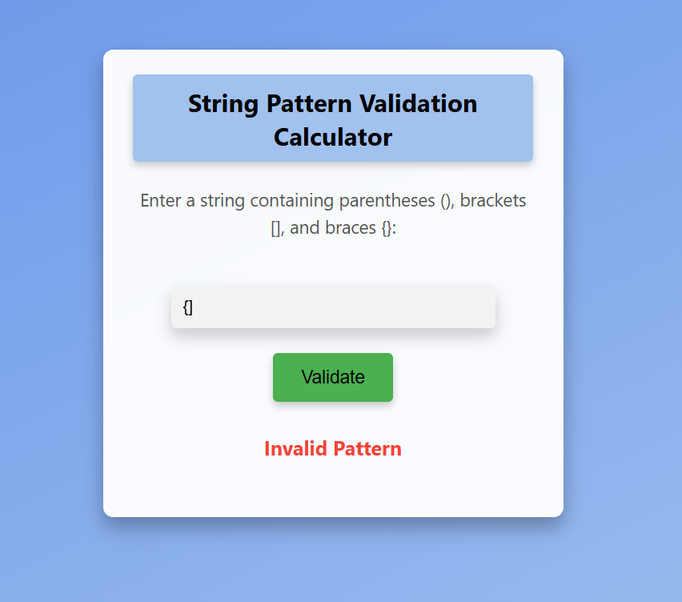

# 
String Pattern Validation Calculator

## Description

The String Pattern Validation Calculator validates string patterns consisting of brackets (parentheses, square brackets, curly braces) to ensure every opening bracket has a corresponding closing bracket in the correct order.

## Features

- Validates various types of bracket patterns including (), [], and {}.
- Provides immediate feedback on whether the entered pattern is valid or invalid.
- User-friendly interface with responsive design.

## Tech Stacks

- HTML
- CSS
- JavaScript

## Screenshots

