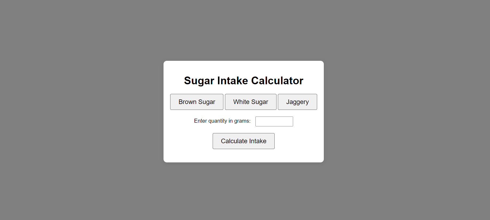

# Sugar Intake Calculator

A simple web application to calculate the sugar intake based on the type and quantity of sugar consumed. The application allows users to select between brown sugar, white sugar, and jaggery, and then input the quantity in grams to calculate the sugar intake.

## Features

- Select between three types of sugar: Brown Sugar, White Sugar, and Jaggery
- Input the quantity of sugar consumed in grams
- Calculate the total sugar intake based on the selected type and quantity
- Responsive and user-friendly design

## Technologies Used

- HTML
- CSS
- JavaScript

## File Structure

- `index.html` - The main HTML file for the application.
- `styles.css` - The CSS file for styling the application.
- `script.js` - The JavaScript file containing the logic for the sugar intake calculation.

## Usage

1. Open the application in a web browser.
2. Select the type of sugar by clicking one of the buttons (Brown Sugar, White Sugar, Jaggery).
3. Enter the quantity of sugar consumed in grams in the input field.
4. Click the "Calculate Intake" button to see the result.
5. The result will display the total sugar intake based on the selected type and quantity of sugar.

## Screenshot
