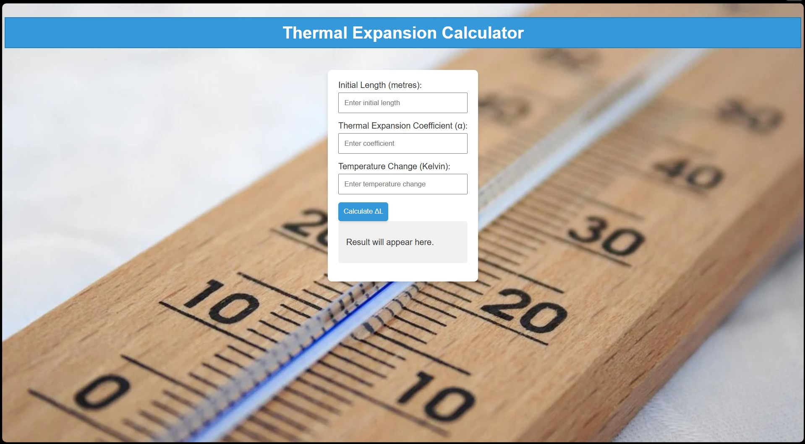

# 
Thermal Expansion Calculator

## Description :-

Any material undergoes thermal expansion according to the formula ΔL = αLΔT, where ΔL is the change in length, α is the thermal expansion coefficient, L is the initial length, and ΔT is the change in temperature.

## Tech Stacks :-

- HTML
- CSS
- JavaScript

## Screenshots :-

