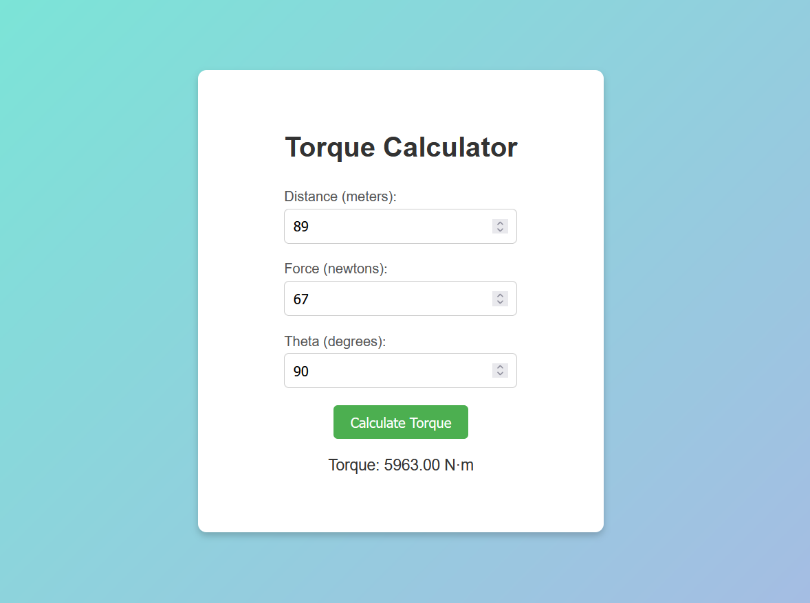

# 
Torque Calculator

## Description :-

It is a simple calculator which calculates the torque on the basis of force, distance and angle entered.

## Tech Stacks :-

- HTML
- CSS
- JavaScript

## Screenshots :-

