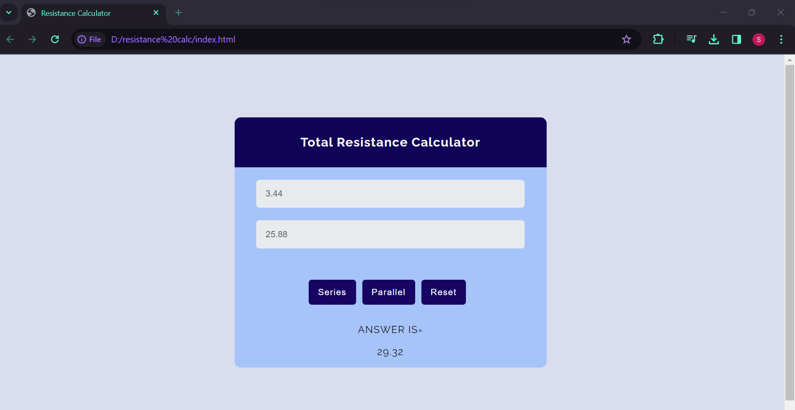
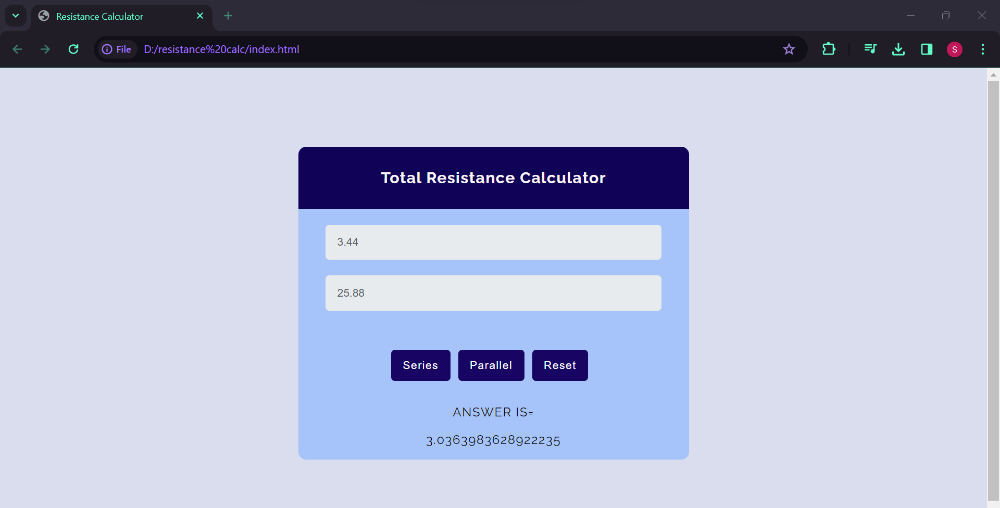

Closes Issue #327

Description :-
This program is a user friendly web page that takes two resistances as input and gives the series or parallel connection total output resistance to the user

Tech Stacks :-
HTML
CSS
JavaScript

Screenshots :

